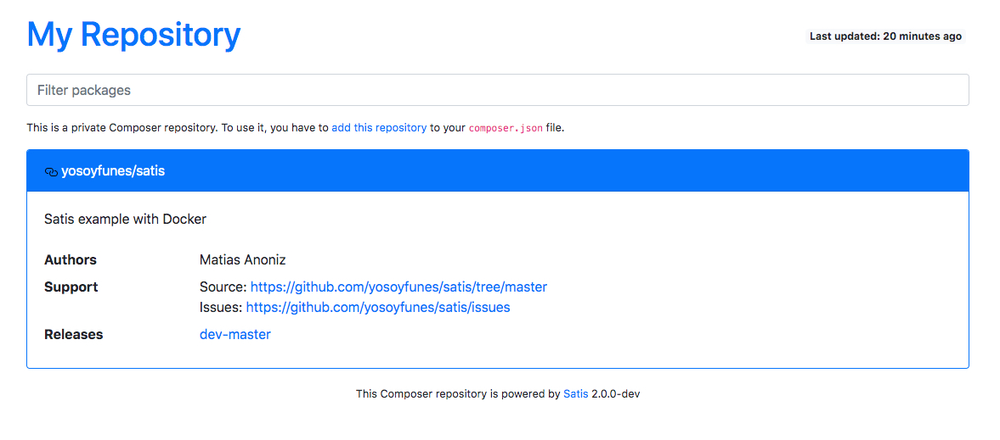

## get started

```
git clone https://github.com/yosoyfunes/satis.git
cd satis
```

## satis build

```
docker run --rm --init -it \
  --user $(id -u):$(id -g) \
  --volume $(pwd):/build \
  --volume "${COMPOSER_HOME:-$HOME/.composer}:/composer" \
  composer/satis build satis.json docs
```

## test local

```
docker run -d -ti -p 8080:80 --name satis -v $PWD/docs:/usr/share/nginx/html nginx
```

## open browser

```
http://localhost:8080
```


